## Hanging-Game
Este proyecto fue realizado inspirado en el popular juego '*Hanging-Game*', usando diferentes tecnologías para una experiencia más entretenida, me divertí y aprendí bastantes cosas en este proceso, espero sea su agrado.

## Hanging-Game
This project was inspired by the popular game '*Hanging-Game*', using different technologies for a more entertaining experience, I had fun and learned quite a few things in this process, I hope you like it.
## Caracteristicas

- Responsive.
- Botones interactivos.
- Alertas dinámicas.
- El usuario puede agregar* nueva palabra* y *pista*.
- Diferentes categorías.
- El usuario puede reiniciar el juego cuantas veces quiera.

## Features
- Responsive.
- Interactive buttons.
- Dynamic alerts.
- User can add* new word* and *track*.
- Different categories.
- The user can restart the game as many times as he wants.
## Authors
- [@Dilson24](https://www.github.com/Dilson24) - Codificación y documentación.
## Screenshots
### Home
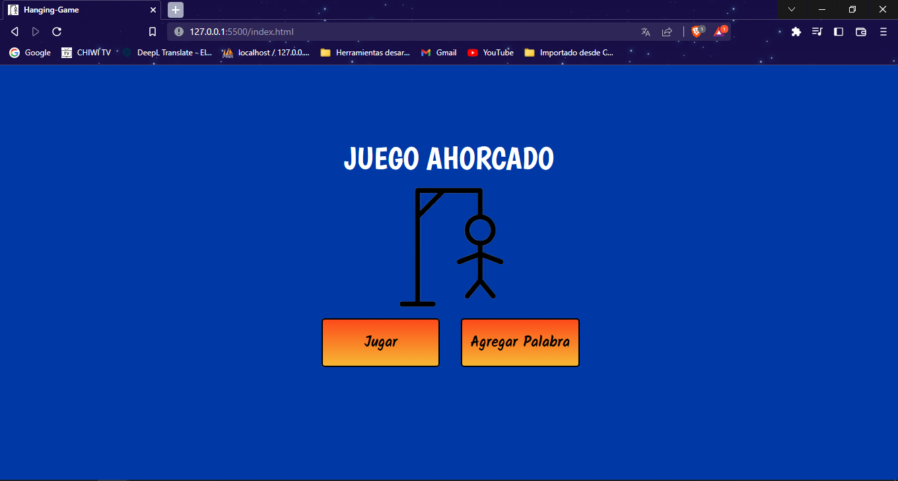
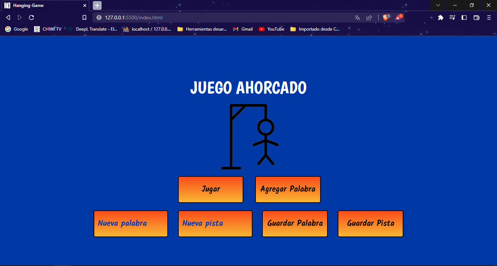
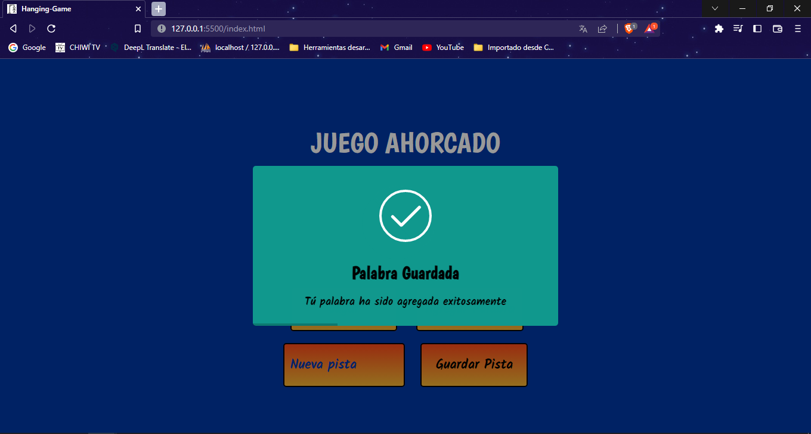
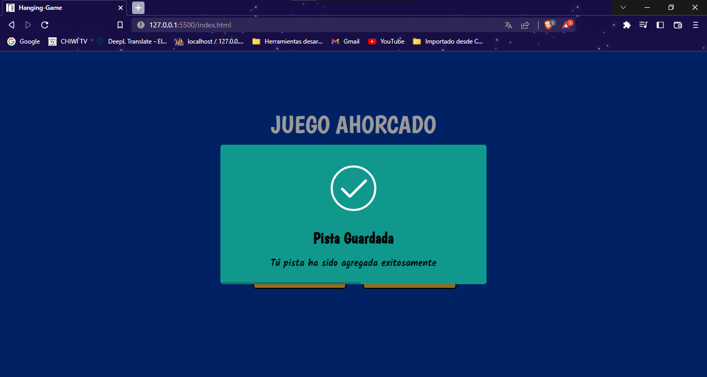

### Start Game

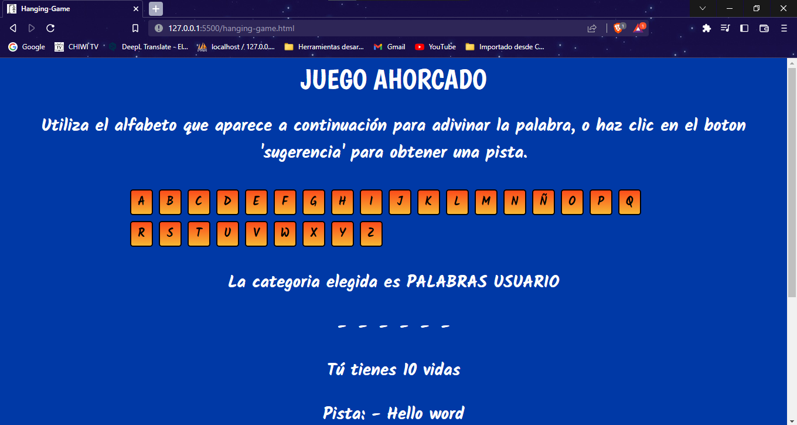
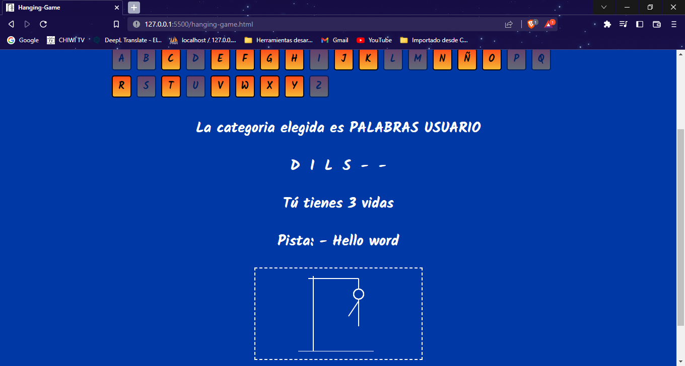
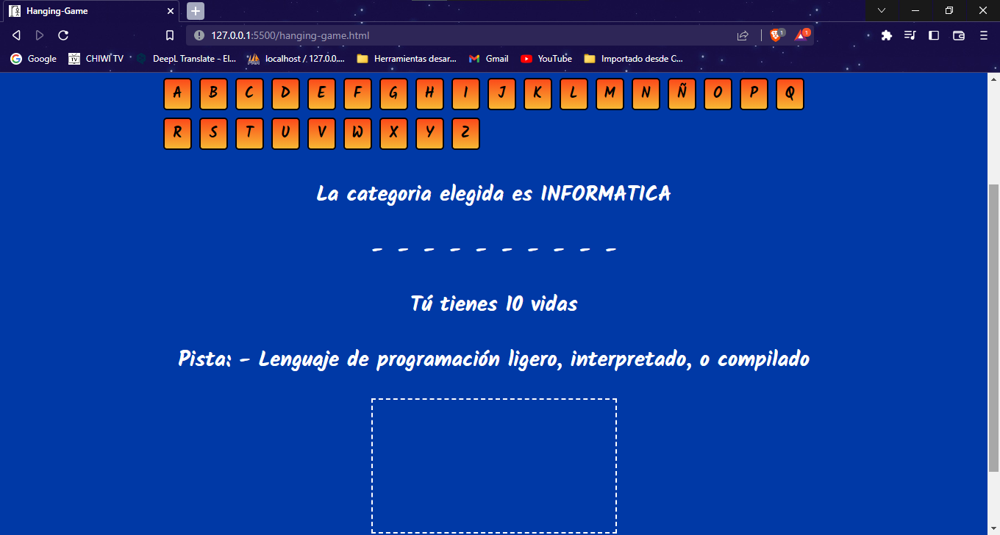
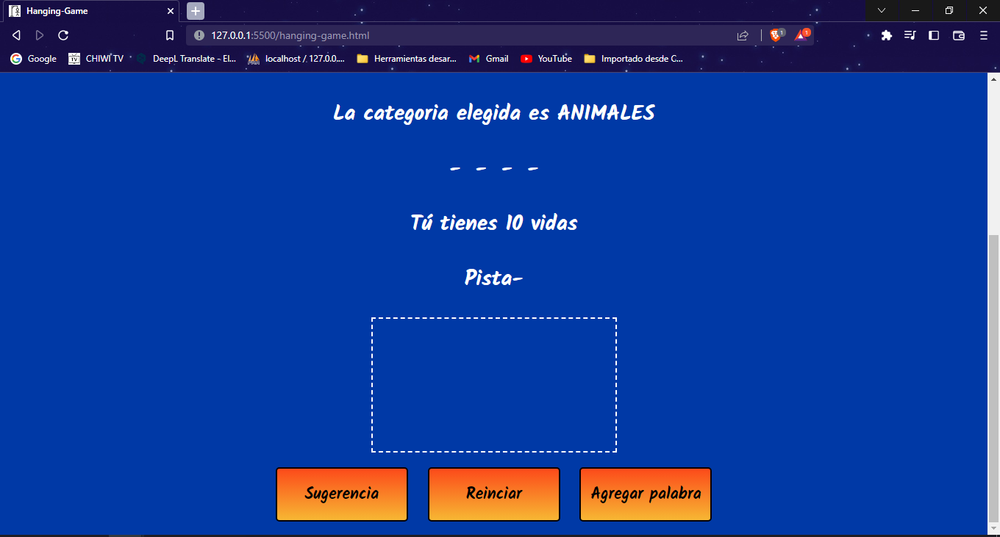
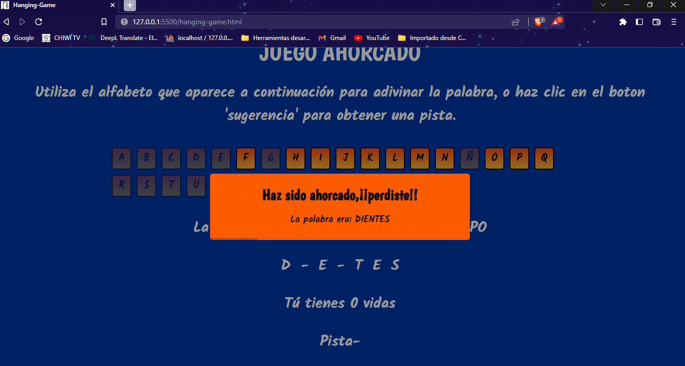

### Responsive

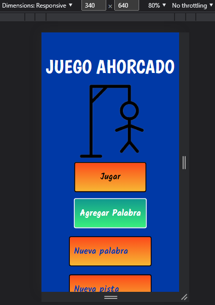
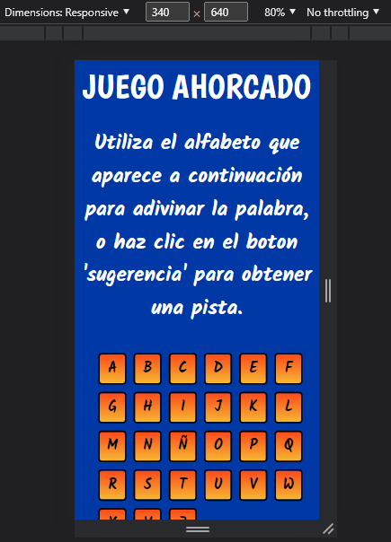

## Tech
- [JavaScript] -  Interpreted programming language.
- [HTML5] - HyperText Markup Language, versión 5.
- [CSS] - Cascading Style Sheets.
- [SweetAlert] - *jQuery* plugin and with which we can give a professional look to the messages we send to users according to current trends.
- [Canvas] - Drawing graphics using scripts.

## License
**Free Software, Hell Yeah!**
[MIT](https://choosealicense.com/licenses/mit/) © 2022-Dilson Alexander Cruz Nivia

 [JavaScript]: <https://lenguajejs.com/>
 [HTML5]: <https://lenguajehtml.com/html/>
 [CSS]: <https://lenguajecss.com/css/>
 [SweetAlert]: <https://sweetalert.js.org/>
 [Canvas]: <https://developer.mozilla.org/es/docs/Web/API/Canvas_API/Tutorial>
